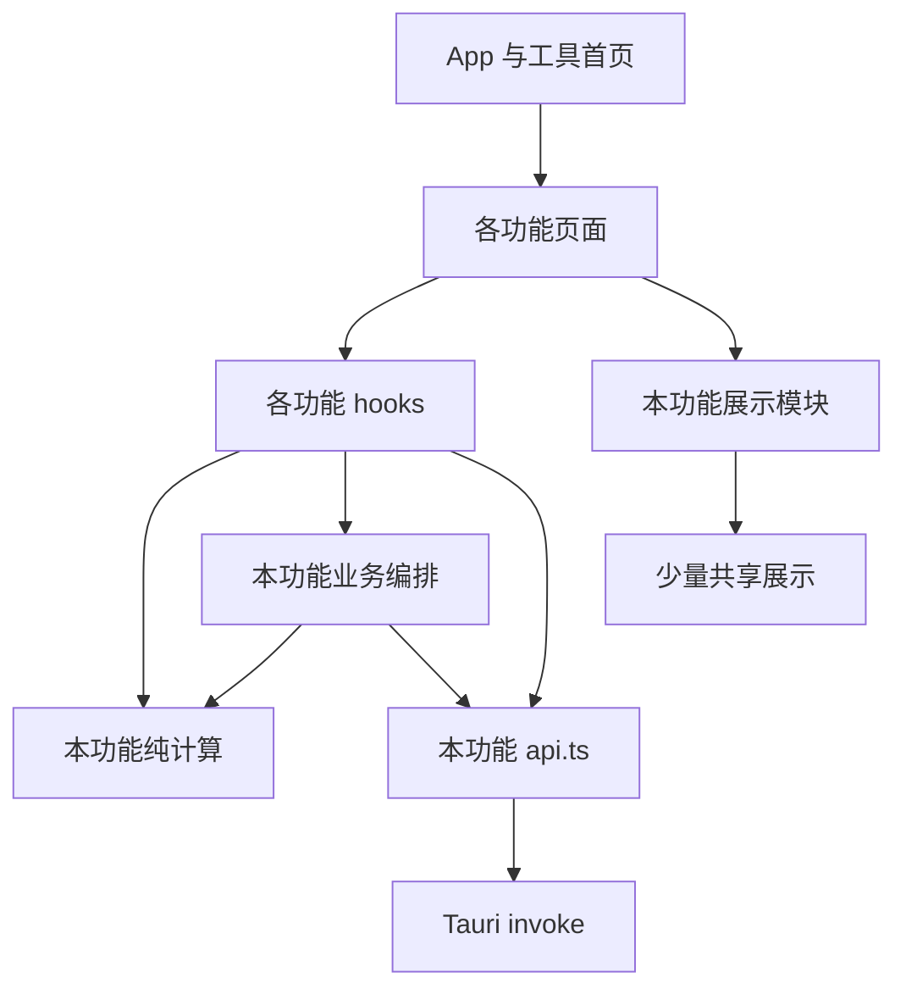

# Toolbox 保持行为的渐进式重构设计

日期：2026-09-25  
状态：设计交付，尚未实施；供用户审阅、其他 agent 执行。  
配套任务包：[实施计划](../plans/2026-09-25-toolbox-refactoring-plan.md)

## 1. 目标与决策

在保持当前功能、交互、文件位置、数据库内容和命令协议的前提下，使代码职责清楚、改动集中、可验证。重点是把已有实现放到合适的位置，而不是重写应用。

采用 **保留功能分组、逐个提取职责、逐步补足行为测试** 的方案：

- 前端保留 `src/plugins/ncm`、`library`、`skills` 以及 `src/toolbox`。
- 页面负责组合展示；功能 hook 负责页面数据与操作；纯函数负责计算；每个功能的 `api.ts` 负责 Tauri 命令调用。
- 后端命令层保持现有协议，内部按功能组织文件，把 SQLite、HTTP、Windows 快捷方式等实现放在各自明确的位置。
- 同一 Cargo package 增加 library target，主程序与阅读状态 CLI 使用同一实现。
- 先完成低风险拆分，再处理下载编排等行为敏感部分。每个任务可单独验证和回退。

其他路线的取舍：

| 路线 | 优点 | 问题 | 决策 |
|---|---|---|---|
| 只格式化并拆 JSX | 改动小 | SQL、命令、下载规则仍纠缠，CLI 仍按路径包含源码 | 作为第一步，不作为最终方案 |
| 保留功能分组并提取职责 | 迁移量可控，调用路径短，便于交接 | 需要记录旧行为、补关键测试 | 推荐 |
| 完整分层架构、通用插件平台、统一状态框架 | 可支持更大系统 | 当前没有相应规模和需求，产生大量转发层 | 不采用 |

不引入路由库、全局状态库、ORM、依赖注入容器、通用仓储 trait、事件总线、插件自动发现、命令代码生成、大型 UI 库。保留 React hooks、Tauri invoke、rusqlite、reqwest。不把前后端迁入 monorepo 或拆成多个 Rust crate。

## 2. 调研范围与可信基线

读取了当前前端入口、全部三个功能的实现、设置和更新流程、Rust 命令与 CLI、现有测试、构建配置、历史设计及 TODO。以下判断以当前源码为准，历史文档仅作背景。

调研时 HEAD：`3b9f993`。工作区已有下列未提交改动：

```text
 M src-tauri/src/bin/library_state_cli.rs
 M src-tauri/src/commands/library.rs
 M src-tauri/src/commands/mod.rs
?? src-tauri/src/commands/read_status.rs
```

这些改动已经把阅读状态和快捷方式操作提取到 `commands/read_status.rs`，CLI 通过 `#[path = "../commands/read_status.rs"]` 复用。本方案沿用其逻辑，不恢复旧版，也不将它当作本轮设计产生的代码。执行前须重新核对工作区；如果期间代码变化，以新的工作区建立基线。禁止 reset、覆盖或自行提交他人的未完成改动。

本轮实际验证：

| 检查 | 结果 | 能证明什么 |
|---|---|---|
| Node 版本 | v26.7.0 | 本机测试环境 |
| `npm test` | 5 个测试文件通过 | 文件内现有断言通过；不等于只有 5 个断言，也不等于完整功能覆盖 |
| `npm run build` | TypeScript 与 Vite 构建通过 | 类型与前端打包基线正常 |
| `cargo test --manifest-path src-tauri/Cargo.toml --all-targets --locked` | 主程序 18 项、CLI 2 项通过 | 主要为纯函数/配置测试；阅读状态的 2 项在两个 target 中重复运行 |

没有操作真实书库、删除真实 skill、切换实际数据库、联网下载音乐、安装更新或打包发布；这些功能的端到端验收仍需执行阶段完成。

## 3. 具体问题与优先级

| 位置 | 已观察到的问题 | 改法 | 优先级 |
|---|---|---|---|
| `src/plugins/library/LibraryTool.tsx` | 112 行但约 21 KB；状态、扫描、乐观保存、递归树、导入监听、改名和删除弹窗、行内编辑挤在一起 | 先展开格式，再按数据操作、树展示、导入生命周期拆分 | 高 |
| `src/plugins/skills/SkillManagerTool.tsx` | 69 行但约 14 KB；列表刷新、分类筛选、菜单、编辑器、分类保存耦合 | 一个功能 hook，表格、分类弹窗、菜单三个展示文件 | 高 |
| `src-tauri/src/commands/library.rs` + `read_status.rs` | 扫描、缓存 SQL、文件操作、阅读状态、COM 相互穿插 | 按图书目录、文件操作、阅读状态、快捷方式、数据访问拆开 | 高 |
| `src-tauri/src/commands/ncm.rs` | 472 行，包含 HTTP、登录持久化、下载文件、下载记录、DTO 与测试 | 命令保持协议，内部拆 auth/client/download/repository | 高 |
| `src-tauri/src/commands/skills.rs` | manifest 解析、目录发现、路径校验、分类事务、删除并存 | 解析、扫描/校验、SQL 分开，操作编排集中 | 中 |
| NCM 下载前端 | 3 种入口策略不同；批量分片和任务计数重复；UI 能直接改 cancelRef 和任务状态 | 共享计算与分片；保留三种策略；先提取完整页面批量流程 | 中高 |
| `src/App.tsx` | 页面选择、网易云标题栏、登录弹窗、快捷动作耦合；`id as any` | 保留轻量页面选择，提取网易云专属视图和浮层，修正类型 | 中 |
| `commands/storage.rs` | 其他功能反向依赖命令模块中的存储工具 | 存储实现移到根 `storage.rs`，命令文件仅保留协议入口 | 中 |
| `SettingsPage.tsx` | JSX 内直接 invoke，类型和数据库操作混在页面 | `toolbox/settings/api.ts` + `useDatabaseSettings.ts` | 中 |
| `main.rs` | Builder、窗口状态、托盘、命令注册混合 | library target 负责装配，desktop 文件负责窗口与托盘 | 中 |
| 重复展示 | 两处返回顶部基本相同；描述编辑器只有部分相似 | 共享返回顶部；描述编辑器暂时各自保留 | 低 |
| 测试和文档 | `store.test.ts` 只有 `assert.equal(1, 1)`；README 描述了已删除的 fallback/插件 SQL；CI Node 20 且不运行测试 | 删除占位测试，补高风险契约测试，文档与验证流程对齐 | 高 |

不以行数越少越好作为验收。把长单行 JSX 展开可能增加行数，但会明显降低阅读成本。

## 4. 必须冻结的兼容约定

### 4.1 跨前后端命令

以下 30 个命令名全部保留；参数名、可空字段、serde camelCase、返回 JSON 形状及错误字符串默认保持：

| 功能 | 命令 |
|---|---|
| NCM 登录 | `ncm_qr_create`、`ncm_qr_check`、`ncm_set_login_cookie`、`ncm_login_status`、`ncm_logout` |
| NCM 内容/下载 | `ncm_playlist_detail`、`ncm_song_detail`、`ncm_player_url`、`ncm_download`、`ncm_open_download_dir` |
| NCM 记录 | `ncm_list_downloaded`、`ncm_mark_downloaded`、`ncm_mark_downloaded_many` |
| 图书 | `library_scan`、`library_cached`、`library_update_metadata`、`library_set_read_status`、`library_open_book`、`library_rename_book`、`library_delete_book`、`library_import` |
| Skill | `skills_scan`、`skills_update_metadata`、`skills_list_categories`、`skills_save_category`、`skills_delete_category`、`skills_delete_skill` |
| 数据库 | `database_location`、`database_migrate`、`database_use_existing` |

容易遗漏的协议：

- `ncm_qr_create` 返回 `qrUrl`；`ncm_player_url` 返回 `{url: string | null}`；`ncm_download` 返回 `{filePath: string}`。
- `ncm_download` 参数为 `id/name/artists/level`，不能改成未适配的 `track` 对象。
- `library_update_metadata`、`skills_update_metadata` 的负载在 `{update: ...}` 内；分类保存在 `{category: ...}` 内。
- `LibraryBook` 保留 `path/relativePath/title/priority/read/bookType/description`。
- 图书导入保留 `done/conflict/failed/partial`，且某些遍历/规范化错误会使整个命令失败，不能擅自改为全部逐项返回。
- `library_set_read_status` 目前不写数据库；下一次扫描同步 read_state 缓存。
- 不为了把 TypeScript 类型写得漂亮而改变 Rust 的 null 序列化。内部类型可收紧，但 wire format 不变。

### 4.2 持久化和系统行为

| 对象 | 保留约定 |
|---|---|
| 数据库 | 文件名 `toolbox.db`；现有表/列名和每功能惰性建表行为；旧图书表补列兼容 |
| SQLite 策略 | 不在结构重构中新增 WAL、连接池、foreign_keys pragma、统一全库初始化或 schema version |
| 存储设置 | app data 下 `toolbox-settings.json`，`databaseDirectory` 字段 |
| 数据库迁移 | 复制、完整性检查、目标不覆盖、保留源文件、成功后写设置；错误时沿用当前清理顺序 |
| 使用已有库 | 文件名严格校验、验证所选库、备份当前库、再切换；保持现有备份命名 |
| 登录 | app data 下 `ncm_login_cookie.txt`；内存状态、加载/失效清理时机不变 |
| 窗口 | `main-window-state.json`，兼容没有 maximized 的旧文件；保留尺寸约束 |
| 图书 | `USERPROFILE/important/books/Library`；`read`/`unread` 与之同级；路径规范化后判断归属 |
| 阅读状态 | `.lnk` 是真实状态来源；数据库为缓存；缺少链接按未读展示；跨状态冲突不能静默选择 |
| Skill 根 | `USERPROFILE/.agents`，不是仅 `.agents/skills`；发现含 SKILL.md 的目录后不继续扫描其子目录 |
| 音频 | 系统 download_dir；当前文件命名和扩展名规则、流式写入、数据库落记录后返回成功 |
| 首页存储 | `toolbox_tool_card_size`、`toolbox_tool_icon_size`（遗留键不删除）、`toolbox_last_ncm_playlist_url` |
| 托盘 | 由 Rust 创建一个图标；点击恢复窗口；关闭主窗口退出整个应用 |
| 更新 | 保留 updater 配置、签名、公钥、发布地址、安装及 relaunch 流程 |

数据库切换后，下一次操作必须重新解析当前数据库位置。不能为了减少 I/O 把连接或路径永久缓存到进程启动时。

### 4.3 两个下载界面并非相同策略

| 维度 | 完整歌单页批量 | 完整歌单页单曲 | 首页快捷下载 |
|---|---|---|---|
| URL 校验 | 正则提取 id，较宽松 | 使用已加载 track | 严格校验 music.163.com 及 playlist 路径 |
| 详情分片 | 每批 200，顺序请求，回填 v | 不重新加载详情 | 每批 200，顺序请求，不回填 v |
| 默认音质 | exhigh | 当前所选音质 | exhigh |
| 并发 | 3 | 每次点击独立发起 | 3 |
| 自动尝试次数 | 最多 3 次，包含首次；等待 500ms、1000ms | 1 次 | 1 次 |
| 取消 | 只阻止尚未开始的任务，已开始任务及其重试继续 | 没有取消 | 下载中不能关闭弹窗，没有中断下载 |
| 进度 | 使用当前任务状态及模拟进度，不是字节进度 | 当前状态更新 | 完成后显示汇总 |
| 记录 | Rust 已写记录，前端仍额外 mark | 同左 | 同左；结果对象还记录同步成功回调异常 |

先用测试固定差异，再共享底层实现。不得把三个流程统一为重试三次或统一为严格 URL 校验。“重试失败”按钮目前只把 error 重置为 pending，不自动启动下载。按“从此首起标记”使用完整 tasks 顺序，不是当前筛选页顺序。

前端额外 mark 的 Promise 未被正确等待是已知问题。此次纯结构阶段保留调用语义；消除冗余记录或改变异步失败统计放到独立行为修复任务，详见第 9 节。

## 5. 前端目标结构与接口

以下是完成相关阶段后出现的文件，不要求先创建空目录或一次性建齐。未列出的现有稳定文件保留。

```text
src/
  App.tsx                           # Provider、轻量页面选择、全局浮层组合
  shared/
    ui/BackToTopButton.tsx          # 两个现有调用点共同使用
  toolbox/
    tools.ts                        # 工具元信息和类型，不再保存 NCM 偏好
    home.ts                         # 首页卡片尺寸/点击等逻辑
    HomePage.tsx
    ToolPageShell.tsx
    SettingsPage.tsx                 # 组合设置展示
    settings/
      api.ts                        # 数据库 DTO 和 3 个 invoke
      useDatabaseSettings.ts        # 选择、确认、迁移、切换及页面状态
    updater.ts / UpdaterButton.tsx   # 已有职责合理，保留
  plugins/
    library/
      api.ts / types.ts / tree.ts
      LibraryTool.tsx               # 页面筛选状态、组合展示与操作回调
      useLibrary.ts                 # 缓存→扫描、刷新、保存/回滚、书籍操作
      LibraryTree.tsx               # 递归树、行、排序头、局部编辑器
      LibraryToolbar.tsx            # 搜索/筛选/导入/刷新控件
      LibraryImportDialog.tsx       # 导入展示、选择状态与结果
      useLibraryImport.ts           # drag-drop 监听、坐标解析、导入生命周期
      LibraryBookDialogs.tsx        # 改名/删除两个相近弹窗
    skills/
      api.ts / types.ts / filters.ts
      SkillManagerTool.tsx          # 页面筛选、菜单/弹窗可见性
      useSkills.ts                  # 加载、描述保存、删除、分类保存/删除
      SkillTable.tsx                # 列表与本地描述编辑器
      SkillCategoryDialog.tsx       # 名称、搜索、选中项与表单状态
      SkillCategoryMenu.tsx         # 右键菜单及 Escape 生命周期
    ncm/
      api.ts / types.ts
      preferences.ts                # 最后一次快捷下载 URL，键名不变
      NcmTool.tsx                   # 原 App 中的 NCM 标题和歌单页组合
      NcmLoginDialog.tsx            # 原 App 中的登录浮层
      NcmAuthContext.tsx / QRLogin.tsx
      PlaylistDownloader.tsx
      usePlaylistLoader.ts / useTaskFiltering.ts / useDownloadActions.ts
      playlist.ts                  # 分片、两种 URL 解析函数
      taskSelectors.ts             # 任务计数、筛选等纯计算
      downloadQueue.ts             # 完整页批量重试/取消编排
      download.ts                  # 单次/快捷批量下载编排；不再包含 invoke
      quickDownload.ts             # 快捷确认业务流程
      useQuickDownload.ts           # 快捷弹窗状态、请求代次与交互动作
      NcmQuickDownloadDialog.tsx / DownloadQueue.tsx
      csv.ts                       # utils.ts 中 CSV 相关函数
```

`utils.ts` 中的 pool 先保持行为移入 `downloadQueue.ts`，两个下载流程可以共用它；不要把 NCM 当前唯一使用的函数提升成全项目通用工具包。`store.ts` 的数据库 invoke 合并到 `api.ts` 后，在调用点迁完且测试通过时删除，避免永久保留一层纯转发。

依赖规则：



纯计算文件不调用 invoke、DOM 或 localStorage；编排文件可以调用 api。这些是具体职责，不要求为图中每个节点创建一层目录。`plugins/*` 不依赖 `toolbox/*`；不同功能不互相导入内部实现。`App` 作为组合入口可以显式导入各功能，不需要插件 registry。

### 5.1 App 与设置

- `type AppView = 'home' | 'settings' | ToolId`，移除 `setView(id as any)`，普通 switch/条件渲染足够。
- 保持 NcmAuthProvider 在所有页面和快捷弹窗的共同祖先，保留启动时登录刷新行为。
- `NcmLoginDialog` 接收 onClose/onLogin，保存遮罩点击和关闭按钮语义。`NcmTool` 接收打开登录回调。
- NCM 偏好移到 `preferences.ts`，App 改导入，不改变键名、默认 URL 和保存时机。
- 保留页面切换的卸载语义和宽度：Library 最大 1280，其余 900。不要意外让隐藏页面长期挂载。
- 设置 hook 保留原生文件选择器、confirm 及既有提示；`api.ts` 只放 DTO 和 invoke，不抽一个通用 RPC 框架。

### 5.2 图书馆

`types.ts` 放 `LibraryBook`、`LibraryFilter`、`LibraryNode`、`ImportResult`。收窄元数据修改类型为 `Partial<Pick<LibraryBook, 'priority' | 'bookType' | 'description'>>`，防止保存接口误改 path/read；后端负载仍发送当前完整三字段。

`useLibrary()` 拥有 books/loading/error，公开 refresh/saveMetadata/setBookRead/renameBook/deleteBook/openBook。隐藏 setBooks；方法内部保留现有调用顺序、乐观更新及回滚。排序、筛选、expanded、弹窗目标仍放页面，因为这是页面交互状态，不应全塞进数据 hook。

- 启动先读取缓存；无论缓存读取成功或失败都继续扫描；有缓存时保持后台更新提示。
- `LibraryTree` 接收树、排序、展开集合以及明确的业务回调。行和星级/描述小控件先留同文件，不为每个按钮建文件。
- `useLibraryImport` 只在导入弹窗挂载期间订阅 Tauri drag-drop；保留异步订阅完成时组件已卸载则立即 unlisten 的处理。
- 保留 position / devicePixelRatio、`data-import-read` 命中、点击预选、leave 清空、onDoneRef 更新，防止把 stale closure 带入新代码。
- 不把导入改成复制；当前是移动。跨盘 rename 失败规则维持。
- `LibraryBookDialogs` 保留 click/mousedown、冒泡阻止、按钮禁用、取消和提交规则，不统一成会改变关闭行为的通用 Modal。

### 5.3 Skill 管理

`useSkills()` 拥有 skills/categories/loading/error 与 refresh、saveDescription、saveCategory、deleteCategory、deleteSkill。维持 scan 与 listCategories 的 Promise.all、保存成功后更新或刷新、确认后删除等流程。

分类弹窗接收 `onSave(payload): Promise<boolean>`，成功才执行现有关闭/刷新流程；表单局部保留 saving。新增或编辑用一个局部联合类型表达：关闭、创建、编辑某分类，替代 null/undefined 双重含义即可，不扩展成通用弹窗状态系统。

搜索时保留已勾选路径；路径去重、分类名称大小写约束仍在后端。Skill 描述与图书描述编辑器的 draft 同步策略不同，先分别保留，不强行共享。

### 5.4 NCM

优先复用已存在的 hooks，不增加一个返回几十个字段的总 hook。

1. `api.ts` 集中所有 NCM invoke；导出明确的 Promise 返回类型，保持参数转换 `toDownloadCommandArgs` 的现有测试意义。转换函数可随 invoke 放 api，类型单独放 types。
2. `playlist.ts` 持有 `extractPlaylistId`、`extractSupportedNcmPlaylistId`、`fetchSongDetailsBatched`。两个解析函数分别命名、分别测试；完整页继续回填 v，快捷预览保持当前 v。
3. `taskSelectors.ts` 的 `countTasks(tasks)` 为过滤 hook 和 DownloadQueue 复用；零首、skipped 状态和进度分母保持旧规则。
4. `useDownloadActions` 不再公开 cancelRef、setFeedback；公开 cancelQueue/retryFailed 等动作。页面不直接修改任务对象来完成业务操作。
5. `downloadQueue.ts` 提取完整页现有批量循环，接收有限依赖 `downloadTrack`、`sleep`、`isCancelled`、`onTaskChange`；生产默认接真实实现，测试给 fake。并发数、最多尝试次数由具体入口固定，不建立可配置策略框架。
6. 单曲与快捷下载先保留独立编排；可共享 pool、单次下载与结果类型，不强行共享重试或取消策略。
7. `useQuickDownload` 完整搬迁弹窗状态、代次 gate、解析、确认、关闭规则；展示文件保留 JSX。原有 loggedIn/validateLogin 可选覆盖先保持，移除前另行检查调用者与测试。

首次提取时不要同时删除 tracks 冗余状态、改变 setInfo/setTracks 的时机或增加自动页面缓存；这些会扩大行为比对范围。

## 6. Rust 目标结构与接口

```text
src-tauri/src/
  main.rs                       # 保留 windows_subsystem 属性；调用 toolbox::run()
  lib.rs                        # 模块声明、run、Builder、插件/状态/命令注册
  desktop.rs                    # 窗口保存恢复、托盘 setup、关闭窗口回调
  storage.rs                    # 数据库位置、设置、打开连接、迁移和备份
  commands/
    mod.rs
    library.rs                  # 8 个稳定命令入口
    ncm.rs                      # 13 个稳定命令入口
    skills.rs                   # 6 个稳定命令入口
    storage.rs                  # 3 个稳定命令入口
  library/
    mod.rs                      # 对命令可见的操作出口/DTO，CLI 的最小公开入口
    paths.rs                    # BooksPaths、规范化/归属校验、遍历、命名规则
    catalog.rs                  # 缓存加载、扫描/状态汇总、扫描更新编排
    repository.rs               # 本功能 SQL、兼容补列、link cache
    files.rs                    # 导入、改名、删除、打开的操作编排
    read_status.rs              # .lnk 阅读状态切换/冲突/目录清理
    shortcuts.rs                # COM 创建/解析和 shell-compatible path
  ncm/
    mod.rs                      # 功能出口和 DTO；不塞入业务长函数
    client.rs                   # 复用 HTTP client、网易云请求与响应转换
    auth.rs                     # LoginState、cookie 生命周期、登录检查
    download.rs                 # 文件名、CDN 检查、流式写入、成功落记录
    repository.rs               # ncm_downloads 的 SQL
  skills/
    mod.rs                      # DTO 与扫描/元数据/分类/删除编排
    manifest.rs                 # 当前 front matter 解析及回退规则
    filesystem.rs               # 发现、规范化、目录归属校验
    repository.rs               # 描述、分类、成员关系与事务
  bin/library_state_cli.rs       # 参数解析、输出和退出码
```

不为 DTO 很少的模块再创建 types.rs；不为每条 SQL 建一个文件。`mod.rs` 可以保留短业务编排，不能退化成只有一堆一行转发，也不能接管所有实现。

### 6.1 Rust library target 与可见性

- 同一个 Cargo package 的 lib 默认 crate 名为 `toolbox`，无需新工作区或新依赖。
- `main.rs` 调用 `toolbox::run()`。CLI 使用 `toolbox::library::set_read_status`，删掉源码 `#[path]` 包含。
- `lib.rs` 的 commands、desktop、storage、ncm、skills 默认私有；`pub mod library` 为 CLI 提供入口。
- library 内除 `pub fn set_read_status(path: String, read: bool)` 外，命令需要的导出用 `pub(crate)`；内部 helper 优先 private 或 `pub(super)`。CLI 不应获得 repository/COM/任意删除接口。
- 新 lib 提取时同步更新 `include_str!` 相对路径，例如原 main 中配置测试搬到 library 文件后重新定位 `tauri.conf.json`。
- Builder 保持插件、LoginState、30 个命令一次性注册；托盘/窗口回调移到 desktop，不重复创建图标。

### 6.2 命令层与实现层

命令层允许存在短转接函数，因为它承载 Tauri 宏、AppHandle/State 注入和 wire contract。除此之外不增加 service→manager→repository 的重复转发链。

命令层负责获取 app data/download/database 路径和 managed state，并调用功能函数。实现尽量接收实际需要的 `&Path`、`&Connection`、`&LoginState`，不把 AppHandle 传到纯路径/SQL/解析函数。

功能内 repository 使用具体 rusqlite Connection 和普通函数，不创建 Repository trait、ConnectionPool 或泛型数据库抽象。它负责本功能 schema 与 SQL，不决定操作系统文件如何迁移。

示意调用关系：

```text
commands::library::library_scan(AppHandle)
  -> storage::open_database(当前 app data)
  -> library::scan(BooksPaths, Connection)
      -> catalog：扫描与状态合并
      -> repository：读写扫描缓存/元数据/link cache
      -> shortcuts：必要时读取 .lnk

library_state_cli
  -> library::set_read_status(path, read)
      -> BooksPaths::from_user_profile()
      -> read_status::set_read_status_at(paths, path, read)
```

BooksPaths 只包含 library/read/unread 三个实际路径，生产从 USERPROFILE 构造，测试直接给临时目录。它是路径集合，不承载数据库、UI、HTTP 或全应用配置。

### 6.3 图书实现的职责

- `paths`：根目录、canonicalize 后校验、相对路径、遍历、书名/扩展名转换。保持原始算法，暂不重写扫描顺序。
- `shortcuts`：Windows COM 的唯一归属。维持当前创建快捷方式在独立线程初始化 COM、读取按原逻辑初始化/释放 COM 的方式；不要为了减少代码把其改到 Tokio worker。
- `read_status`：根据 source/target 链接集合判断冲突、迁移或创建；不依赖 SQLite 或 Tauri。
- `catalog`：cached 列表、全量扫描、read/unread 冲突检测、失效书籍缓存删除。真实文件和快捷方式优先于缓存。
- `repository`：库表与 link cache SQL，包括现有补列流程。先不把每次 ALTER 的处理顺手改为新版迁移框架。
- `files`：维护文件、快捷方式和元数据的现有执行顺序。跨资源操作不是 SQLite 事务可以整体回滚的，不能承诺原子性。

### 6.4 NCM 与存储

- client 继续复用 OnceLock<Client>，保持 timeout 15s、connect_timeout 10s、pool_idle_timeout 90s 和请求头。调用 client 功能函数，不从内部直接调用另一个带 `#[tauri::command]` 的函数。
- `ncm_download` 内目前直接调用 `ncm_player_url`，重构后两者共用 client 的取播放地址函数，输出分别保持各自协议。
- auth 保持登录 Cookie 读取、保存、失效删除的先后关系及 Mutex 锁的短生命周期，不持锁跨 await。
- download 保留流式写入、flush 后记录下载，以及 SQLite 写入通过 spawn_blocking 执行的方式。不要在拆文件时退化为全量 bytes 读入内存。
- storage 使用具体 app data 路径作为内部输入，便于临时目录测试。AppHandle 的路径解析留在命令/启动适配处；所有调用者仍在每次操作时读取设置。
- storage 只统一连接位置，不接管每个功能的 schema。不要在应用启动时建齐所有表，避免改变已有数据库导入后的初始化时机。

## 7. 测试设计：覆盖行为，不绑定文件结构

沿用 Node 原生测试和 Rust 自带测试。函数搬家不需要新增“源码包含某个函数名”的测试。`assert.equal(1, 1)` 应删除或替换成真实契约测试。

### 7.1 自动化最低覆盖

| 范围 | 必须覆盖的行为 |
|---|---|
| NCM 解析/加载 | 两种 URL 校验的差异；空列表；401 首分成 200/200/1；顺序；完整页 v 回填、快捷 v 保持 |
| 下载编排 | 同时 in-flight 不超过 3；最多 3 次包含首次；500/1000ms 等待；取消只挡未开始；最后任务结束才退出 busy；单曲和快捷单次尝试 |
| 下载结果 | 下载失败不计成功；同步成功回调抛错仍算文件成功并计 callbackFailures；旧成功记录不被空 path 覆盖 |
| 快捷弹窗 | gate invalidate 后旧响应不写状态；关闭再打开重置；登录校验/空列表/错误 URL 的既有判断顺序 |
| 任务计算/CSV | 所有状态计数；skipped 规则；搜索/分页/筛选；CSV 字段顺序和双引号/逗号/换行转义 |
| 图书树 | 格式、路径分隔符、空文件夹过滤、目录先于书、目录中文排序、三态排序和筛选组合 |
| 图书路径 | 根外文件拒绝、保留扩展名、中文/空格路径、现有非法名规则、link_path 镜像规则 |
| 阅读状态 | 无链接创建；已有同状态不重复；跨状态冲突；来源多个链接；目标同名链接指向他书时拒绝 |
| 图书数据库 | 旧表缺 3 个缓存字段可补齐；扫描保留描述/星级/分类；cached 排序；失效项清除；link stamp 命中/失效 |
| Skill | 现有 front matter 解析及 fallback；扫描去重/根外拒绝；保存描述不改 SKILL.md；分类去重/名称冲突/更新不存在分类/事务失败回滚 |
| 存储 | 无配置默认位置；非法配置；目标存在不覆盖；迁移保留源；切换校验失败不改设置；切换成功备份存在；下一次连接读新位置 |
| 协议 | 代表性 DTO 序列化；invoke 参数及返回类型；30 个命令注册；CLI 无参/错参退出 2、操作失败退出 1、成功退出 0 |
| 桌面 | 保留旧窗口 JSON 兼容和无配置托盘的现有测试 |

测试分层与限制：

- repository 使用内存 SQLite；需要迁移/路径切换的测试使用临时目录中的真实小 SQLite 文件。
- COM 集成在 Windows 上用临时书库和真实 .lnk，不使用用户真实目录。路径通过参数注入，避免测试并行时更改进程 USERPROFILE。
- 下载编排使用假下载函数和可控 Promise/假 sleep，断言并发与顺序，不依赖真实网易云账户或公网响应。
- UI 状态与 listener 清理在本轮以明确手测验收为最低要求；若执行时引入自动化 UI 测试，只选一个最小测试工具，不同时部署多套框架。本方案不把引入 UI runner 作为全部重构的前置条件。
- 原测试在移动后保留断言意义；不要因为位置变了就删掉已有回归场景。lib 提取后重复运行的测试可能去重，验收看场景，不机械要求原来 20 的总数。

### 7.2 必须人工验收的场景

执行 agent 要逐项报告 pass/fail/blocked，禁止用“build 通过”替代：

1. 首页左键/键盘进入、右键菜单先关闭再动作、Ctrl+滚轮卡片尺寸与重启恢复、返回首页。
2. NCM 扫码/刷新/登录持久化/退出，完整页解析、筛选、翻页、CSV、单曲/批量、取消和失败重置、从此首标记、快捷预览过期响应、下载时关闭限制。
3. 图书先缓存再扫描、展开/筛选/排序、星级归零、分类编辑、描述失焦保存失败后的状态、阅读状态冲突、中文带空格书名改名、删除和拖拽导入。
4. 图书导入测试 100% 与非 100% 缩放；弹窗关闭再打开不出现双监听；拖入文件/文件夹、同名冲突、移动失败与 partial 状态。
5. Skill 扫描、搜索、分类新增/编辑/删除、搜索后勾选保持、描述保存、目录删除及相关元数据行为。
6. 临时数据库迁移、切换、备份、随后进入三个功能读取目标库；失败不误报成功。
7. 窗口恢复、托盘只有一个、托盘唤回、窗口关闭退出；更新按钮状态显示，不为测试实际安装未知更新。

破坏性场景只在临时夹具中进行。真实 UI 若无法配置临时根，使用单独测试账户/隔离用户配置运行；不得拿日常书库、skill 目录或数据库作删除/迁移实验。

## 8. 实施纪律与完成标准

- 每个任务依次做“基线/契约→机械迁移→必要解耦→验证”。格式化提交与逻辑提交分开；不一次格式化整个仓库。
- 只迁移当前任务拥有的文件，保持功能可运行。新文件有真实职责和调用者，不预建空壳。
- 命令名和 wire format 不变，因此前后端可以分开重构；每次合入后仍须联合 build/test。
- 新抽象必须说明哪个重复实现或哪个具体外部依赖被收拢。只有一个调用点的普通短 helper 可以留在原文件。
- 不用全量 CSS 重构掩盖业务 diff；先保持原样式与 DOM 层级。返回顶部共享是少数确定重复项。
- 不因 hook 拆分改变 useEffect 依赖触发次数、组件 key、挂载位置、确认框类型或错误清理时机。
- 本轮不改版本号、不生成安装包、不触发发布、不部署。

最终交付必须满足：现有功能入口完整，30 个命令兼容；旧库/配置兼容；无循环依赖和功能间私下互用；高风险新增测试有效；全部基线命令通过；人工验收有记录；README 与实际结构一致；无占位测试、临时双实现和不再使用的纯转发文件。

## 9. 独立的问题清单：不得混入纯结构任务

这些是源码观察到的行为风险或待验证问题，不是本方案默认授权的行为修改。结构阶段记录并保留现状；后续需单独明确预期、写失败测试、提交修复。

| 问题 | 证据/影响 | 独立处理方向 |
|---|---|---|
| 歌单 load 没有 catch | `usePlaylistLoader` 只有 finally，网络失败可能未显示错误且保留部分状态 | 明确失败后旧列表如何保留，再处理错误提示与请求代次 |
| QR 轮询竞态 | setInterval 内异步请求可重叠；create 无 catch；StrictMode/快速刷新可能产生旧请求回写 | 单一轮询生命周期、序号和错误处理 |
| 前端重复记录下载 | Rust 成功已落库，前端又 mark；快捷 onSuccess 声明 void 且不 await Promise | 选择 Rust 成功作为记录事实；保留显式手动 mark；单独变更结果统计/失败协议 |
| 目录扫描循环 | library walk 与 skills discover 无 visited 集合，目录链接可能形成环 | 加遍历集合/路径策略前先确定链接语义和夹具 |
| 分类删除级联不确定 | schema 声明 ON DELETE CASCADE，但当前 open_database 没有显式启用 foreign_keys | 用实际连接 fixture 检查 pragma/删除结果，再单独选择显式删除或启用约束 |
| 文件操作部分成功 | 改名/删除/导入跨文件、快捷方式、DB，失败后可能留中间状态 | 单独定义补偿/恢复策略；不在提取过程中添加事务框架 |
| 同名不同扩展名的状态链接 | `with_extension("lnk")` 让 foo.pdf 与 foo.epub 对应同名链接 | 涉及已有链接迁移，单独设计，不改命名掩盖问题 |
| 异步元数据覆盖 | 分类按键即保存、乐观回滚可与后续编辑交错 | 每书写入顺序/字段级保存需单独确定 |
| 假设跨平台 | 当前 COM、USERPROFILE、explorer、cmd 明确依赖 Windows | README 说明当前支持范围；跨平台另立任务 |
| 历史 TODO 与当前代码不符 | 有已删除插件、已实现项和未完成项混杂 | 校正文档，不能把历史勾选当验收证据 |

还不做：真实中断网络下载、断点续传、后台持久化队列、搜索防抖、窗口/托盘行为改版、Cookie 存储机制迁移、扫描性能工程。它们不是保持行为的结构整理。
